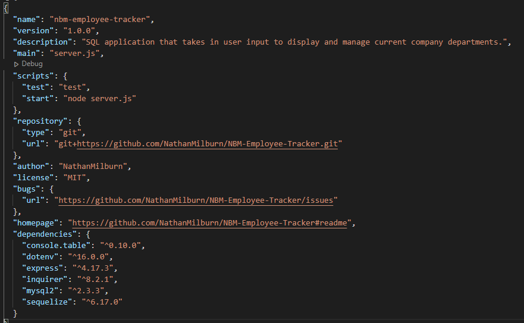
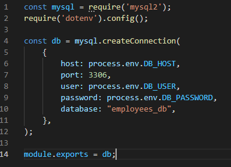
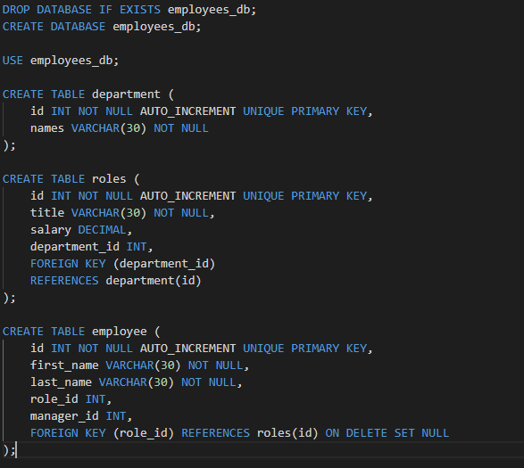
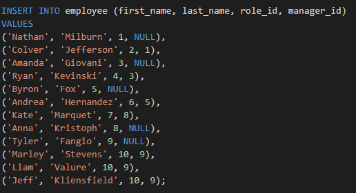
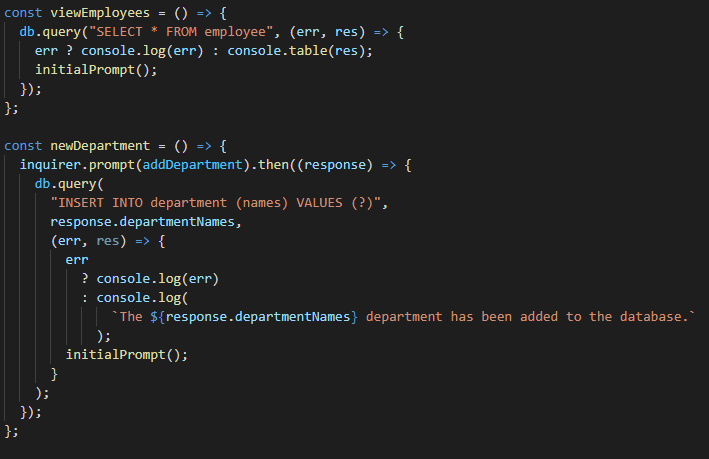

# NBM-Employee-Tracker

## USER STORY

    AS A web developer
    I WANT to create a database that can be updated and manipulated
    SO THAT I can utilize a responsive view of a companies departments, roles, and employees for better organization.

## TABLE OF CONTENTS

- [DESCRIPTION](#description)
- [INSTALLATION](#installation)
- [LICENSE](#license)
- [CONTRIBUTING](#contributing)
- [QUESTIONS](#questions)

## DESCRIPTION
This is a node application that takes in a seeds file to generate pre-existing company information such as departments, roles, and employees, and allows the user to manipulate, add, or update information through an inquirer prompt in node. 

## APPLICATION IN USE

Here is a link to a video of the application in use:
[ApplicationInUse](https://www.youtube.com/watch?v=SenLbj3D2sE "Application In Use")

## INSTALLATION
This application utilized a multitude of different node module packages, but mainly utilized mysql2, sequelize, express, inquirer, console.table, and dotenv. Once the appropriate modules have been installed, the user must sign into mysql through their command line to source the schema.sql file followed by the seeds.sql file to populate the database with table information and data. Once the schema and seeds files have been sourced, the user will run the server through node and go through any of the available actions they chose for this database. 

The actions that are available to the user are:  
- View All Departments
- View All Roles 
- View All Employees
- Add a Department
- Add a Role
- Add an Employee
- Update a Role
- Quit

Package.Json Modules:

SQL Connection Routes:

Base Schema File: 

Initial Seeds File:

Example Questionaire:

SELECT and INSERT Function Examples: 

## LICENSE

The license included for the project is under MIT

## CONTRIBUTING

For this application I mostly used the activities and class videos from our Unit 12 and 13 sections of class as reference for constructing my sql files, routes, inquirer prompts and functions. The Repos for each unit are:

Week 12
https://uwa.bootcampcontent.com/UWA-Bootcamp/uw-blv-virt-fsf-pt-12-2021-u-c/-/tree/master/12-SQL

Week 13
https://uwa.bootcampcontent.com/UWA-Bootcamp/uw-blv-virt-fsf-pt-12-2021-u-c/-/tree/master/13-ORM

## CHALLENGES FACED

The main challenges faced in this project was figuring out how to restructure inquirer prompts to link between each database table and action. For projects like the Team Profile Generator, the inquirer prompt would have a function at the end of each questionaire prompt to generate a card for that employee, but for this project, the user needed to be able to have their action affect multiple tables while maintaining the ability to be updated later. My original approach was to have a function for each question involved, but was unsuccessful once I tried to create or update multiple employees for a specific role or department.

## QUESTIONS

If you have any further questions about this module or improvement ideas, please feel free to connect on either GitHub or LinkedIn, or email me at:

- GitHub: https://github.com/NathanMilburn
- LinkedIn: https://www.linkedin.com/in/nathan-milburn-55487513a/
- E-Mail: nathan.milburn@outlook.com
